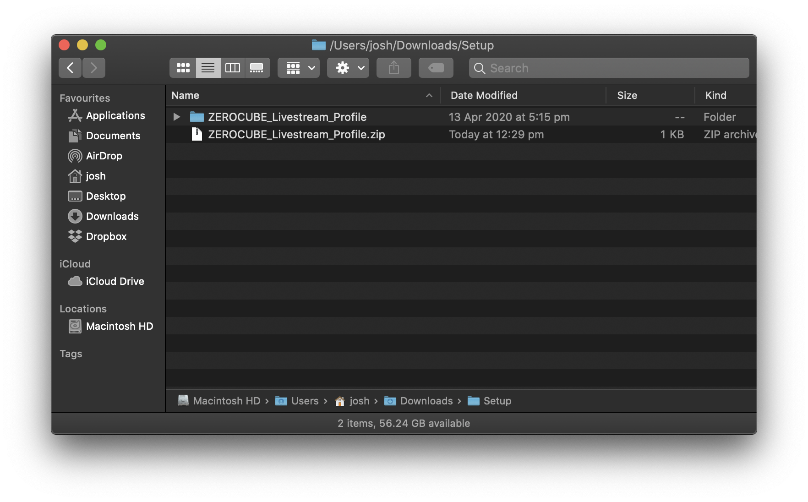
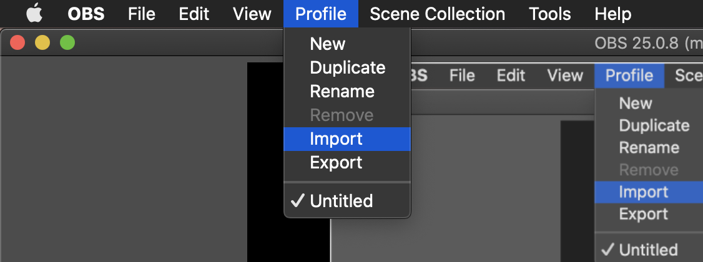
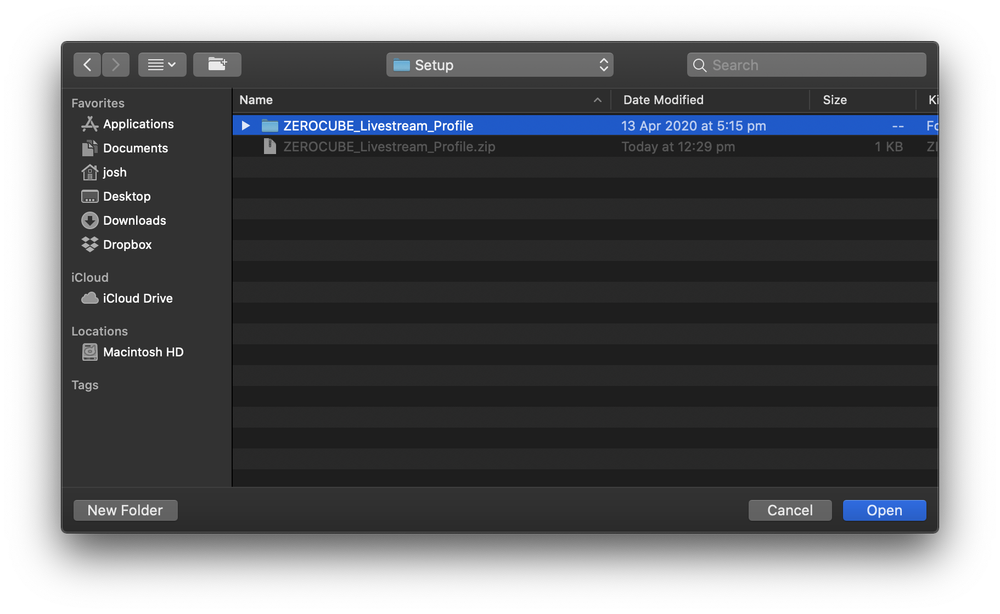
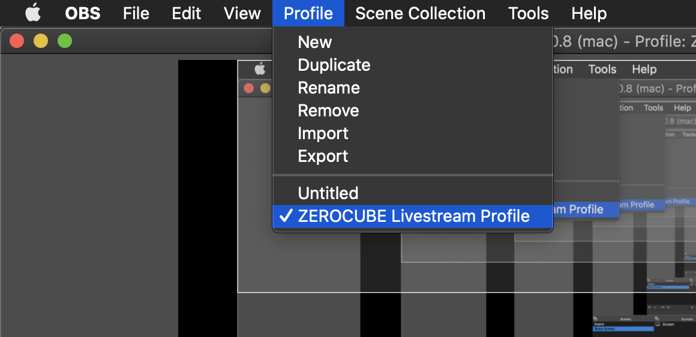

Download the ZEROCUBE Profile zip file:  
https://github.com/zerocube/jd-onboarding/blob/main/obs-profiles/ZEROCUBE_Livestream_Profile.zip

Once you've downloaded it, extract it to somewhere on your system.

Once you've extracted it somewhere on your system, import the profile into OBS.  
(Menubar: `Profile` -> `Import` -> select the extracted folder -> `Open`).

Then select the profile (Menubar: `Profile` -> `ZEROCUBE Livestream Profile`)

Once you've selected the ZEROCUBE Profile, head on to the next step.
