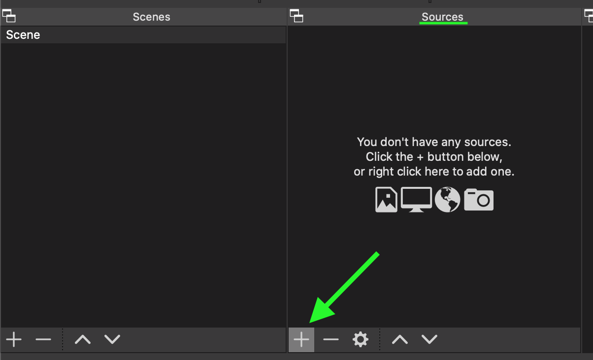
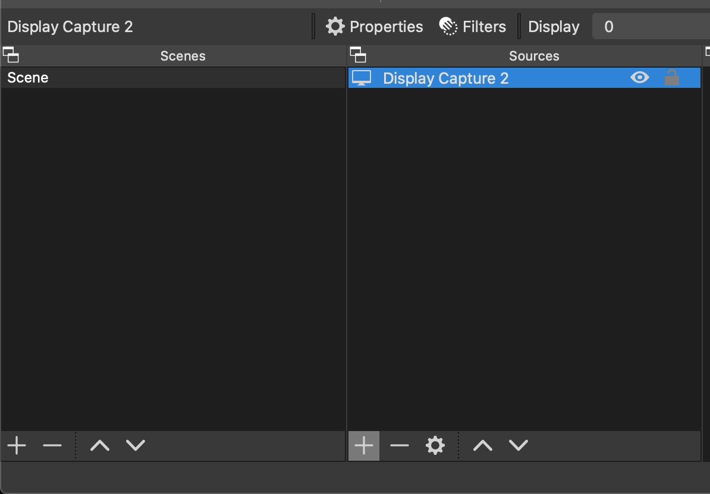

In the bottom left of the OBS screen, you will see two sections we're going to use to set up what OBS is sending to the
remote studio: The **Scenes** and **Sources** panels.

## Scenes

This panel is where all the scenes are stored. The one that is highlighted is the one that's "active".

In this case, we can use the one that is created already.

## Sources

Sources are elements that are in a scene. In this particular case, we're going to capture the display as a source.

### Allowing OBS to record the screen

  !
  
  This is a required step if you are using OBS on MacOS.
  

Open **System Preferences**, then select **Security & Privacy**.

Scroll down to **Screen Recording** in the pane on the left, then make sure that **OBS** is checked on the right.

 

### Add the source: Display Capture

With the scene selected, we need to click the '+' button at the bottom of the **Sources** panel.

In the menu that appears, select "Display Capture".

<em>In this dialog you can click 'OK' to use the suggested defaults.</em>

### Pick a screen, any screen...

When you see the window below, you can choose the screen that you want to send to us.

We recommend using two displays - For example, your laptop and an external screen, or two screens connected to your
desktop.

Select the screen that you will be presenting with. We recommend keeping this display free of anything else, such as
other applications.

If you use the cursor to gesture during your presentation, leave **Show Cursor** checked.  
Otherwise, please un-check this box.

Once that's done, click **OK**.

### Sizing it up

With the previous dialog now closed and out of the way, you should see your Display Capture source inside your scene.

Right-click on the Display Capture source we added, and select **Transform &rarr; Fit to screen**

You should notice now that your entire display is visible within the OBS preview window.

### Mute some things

In the bottom set of panes, there should be one called **Audio Mixer**.

Below it are one (or more) audio sources. Click the speaker icon on any sources in this list.

<em>Once clicked, the speaker should go red, indicating it is muted.</em>

Once you've done that, you can head on over to the next step!
