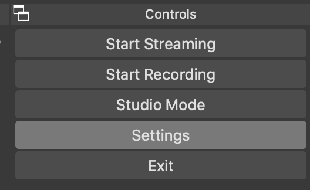
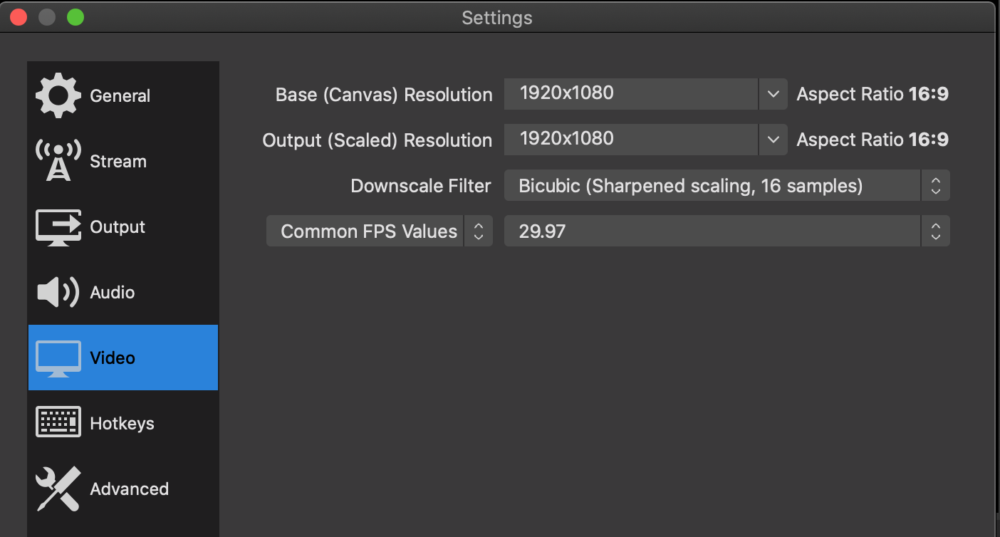
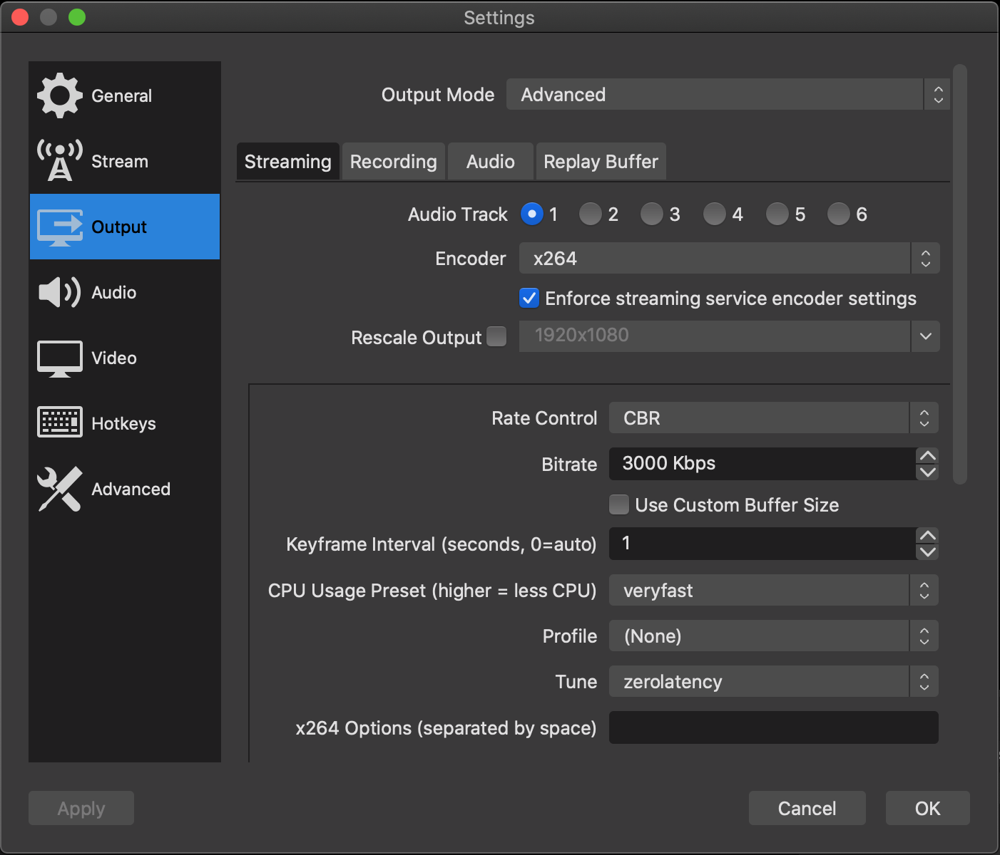
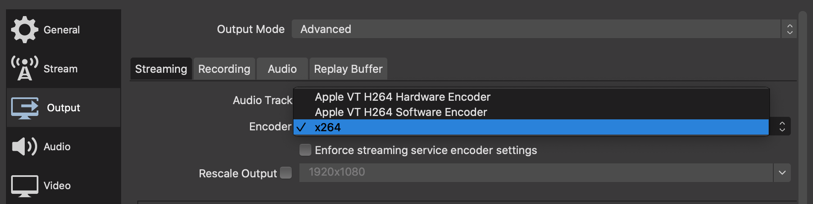
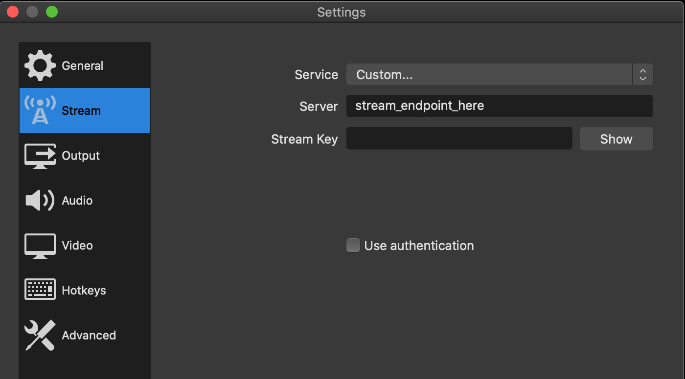

In the bottom-right of the OBS window, click **Settings**.



### Video

The first thing we're going to check is that the **Video** configuration has imported correctly.  
It should look something like this:



The key bits are:  
```
Base (Canvas) Resolution:   1920x1080
Output (Scaled) Resolution: 1920x1080
FPS:                        29.97
```

### Output

Now let's move on to the **Output** settings:  


The key bits are:

```
Encoder:        x264 (aka "H.264" or "libx264")
Rescale Output: Unchecked
Rate Control:   CBR
Bitrate:        3000kbps
Tune:           zerolatency
```

#### A note on the Encoder setting

You may have some encoder types available to you, such as hardware encoders (e.g. Apple's H.264 Hardware Encoder, or
an NVidia NVENC H.264 encoder).



We've found that selecting these hardware encoders in this section can sometimes cause issues connecting to the stream
server, so if you wish to use a hardware encoder, please test the connection ahead of time (more on that later).

### Stream Settings

In this section, you should see that the **Server** field has been pre-filled with a dummy value.

You will be given a link that begins with `srt://`, and this is the link you copy and paste in this **Server** field.


<p style="text-align:center;font-style:italic;">
  If you don't have the link yet, please let us know in the presenter onboarding channel.
</p>

Once you've got the SRT link loaded in to the **Server** field, click **OK** and move on to the next step :)
