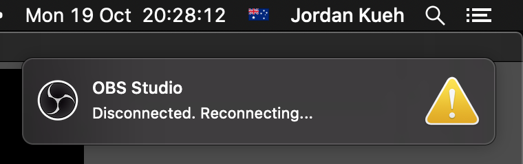

With the `srt` link entered into the OBS settings in the [previous step](../04-streaming-settings#stream-settings),
we're now ready to start sending our presentation video stream to the studio.

When the studio is not online for a rehearsal or production, streams are routed to a test service.  
Streams are not recorded on the test service, which makes it great for testing on your own.

**Note:** We recommend testing on the same network and location you will be using for rehearsals and the presentation.

To start sending your video to the studio, click **Start streaming** in the bottom right of the OBS window.

After clicking stream, OBS will try and connect to the studio.

A small icon at the bottom-right hand side of the OBS window should become green, and the bitrate on the right - in this
case, `3164 kb/s` should be similar to the data rate we double-checked in the previous step:

### Troubleshooting hardware encoders

If you chose a hardware encoder, and you are getting this notification quite frequently:

This means that the hardware encoder is not compatible with our stream format (The example above comes from using the
`Apple VT H264 Encoder` on a mid-2015 Macbook Pro):

Another indicator is a data rate of `0 kb/s` in the bottom right, despite the icon being green.

### Further troubleshooting

To view additional stats about the stream you are sending to the studio, click **View &rarr; Stats** via the menu bar:

This will present the following dialog:

The three key indicators are:

* Frames missed due to rendering lag
* Skipped frames due to encoding lag
* Dropped Frames (Network)

#### Frames missed due to rendering lag

If this number is above 0, and steadily climbing - This is typically indicative of an overloaded machine.

Ensure that any non-essential applications are closed.

#### Skipped frames due to encoding lag

This can also be indicative of an overloaded machine. As above, close any applications you're not using.

If you're using a hardware encoder, ensure no other application is using the hardware encoder.

#### Dropped Frames (Network)

This is often the sign of an unstable network. Ensure that any other applications and/or machines on your network are
not running unless needed.

Alternatively, it may be worth considering lowering your bitrate.  
The lowest recommended bitrate is `2000kbps`.

If you are unsure, reach out to us in the presenter onboarding Slack channel.
